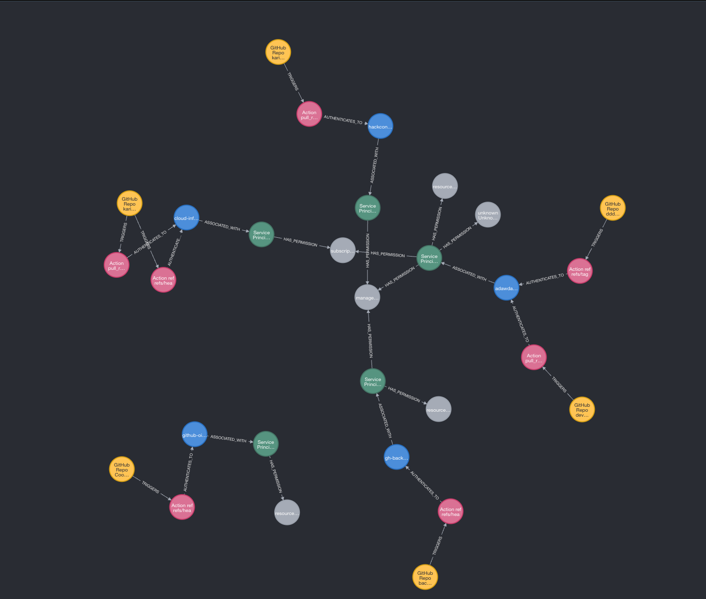

# OIDC Code to Cloud

# Overview
This project fetches and processes data from Entra ID tenants and Azure Resource Manager to demonstrate attack paths using Neo4j. It is being released in connection with HackCon by O3 Cyber and is designed to illustrate potential security attack vectors using real-world tenant data.



# Getting started

To get started, make sure you have the prereqs:

## Pre-requisities
* Python3 (tested on version 3.13)
* Neo4j Community Edition
* Reader on Tenant Root Group and Global Reader in an Entra ID tenant

## Setup 
1. Log on to your Neo4j for the first time, the username/password used in the main.py is neo4j/password
2. pip install -r requirements.txt
3. Make sure you are authenticated to Entra ID and Azure Resource Manager with Azure CLI or have a config.py file with the credentials.
4. Run the `main.py`

# Details
## Authentication Methods
You can choose between two methods to authenticate:
- **Using `config.py`:**  
  Create a configuration file (`config.py`) with your tenant credentials.
- **Using Azure CLI:**  
  Log in via Azure CLI with `az login` so that `DefaultAzureCredential` can pick up your credentials.

## Caching Strategy
Data fetched from both Graph and ARM APIs can be cached locally. Use the `--use-cache` flag when running `main.py` to load already fetched data. Running without the flag forces a fresh API call.

## Running the Project
- **With cache:**  
  ```bash
  python main.py --use-cache
  ```
- **Without cache:**  
  ```bash
  python main.py
  ```


## Example Visualization Queries
```
// Visualize AzureApps and their connected GitHub Repositories
MATCH path = (app:AzureApp)-[*1..2]-(repo:GitHubRepo)
RETURN path;

// Visualize Service Principals with their Azure Apps
MATCH path = (sp:ServicePrincipal)-[*1..1]-(app:AzureApp)
RETURN path;

// Visualize GitHub Repos and their Actions
MATCH path = (repo:GitHubRepo)-[*1..1]-(action:GitHubAction)
RETURN path;

// Visualize Azure Apps with multiple GitHub repositories
MATCH path = (app:AzureApp)-[*1..2]-(repo:GitHubRepo)
WITH app, count(DISTINCT repo) as repoCount, collect(path) as paths
WHERE repoCount > 1
RETURN paths;

// Visualize all pull request actions and their connections
MATCH path = (action:GitHubAction)-[*1..2]-(n)
WHERE action.label CONTAINS 'pull_request'
RETURN path;
```

## Example Data Queries
```
// Find all AzureApps and their connected GitHub Repositories
MATCH (app:AzureApp)-[r*1..2]-(repo:GitHubRepo)
RETURN app.label AS AzureApp, repo.label AS GitHubRepo;

// Find all Service Principals with their associated Azure Apps and role names
MATCH (sp:ServicePrincipal)-[r]-(app:AzureApp)
RETURN sp.label AS ServicePrincipal, 
       app.label AS AzureApp,
       sp.roleName AS RoleName;

// Find GitHub Actions associated with specific repositories
MATCH (repo:GitHubRepo)-[r]-(action:GitHubAction)
RETURN repo.label AS Repository,
       action.label AS Action,
       action.id AS ActionID;

// Find all pull request actions
MATCH (action:GitHubAction)
WHERE action.label CONTAINS 'pull_request'
RETURN action.label AS PullRequestAction,
       action.id AS ActionID;

```
